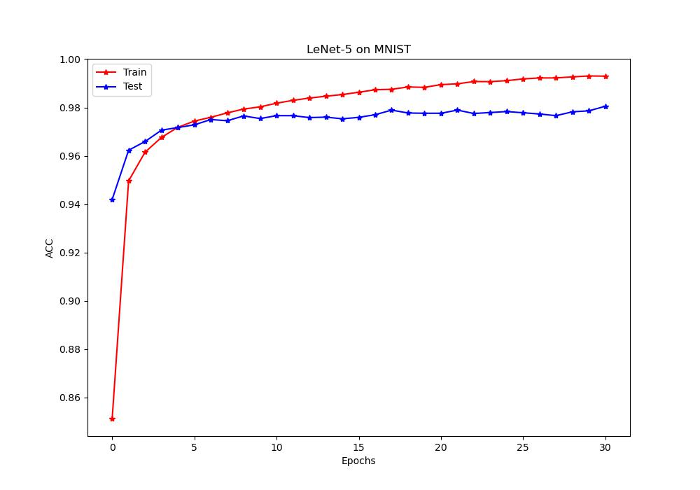
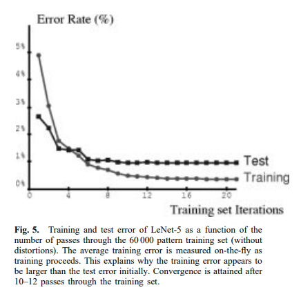

# 基于Pytorch复现LeNet-5在MNIST数据集的实现

本文使用Pytorch构建了经典的LeNet-5网络，数据集为[MNIST数据集](http://yann.lecun.com/exdb/mnist/)，并提供了一个预训练模型与结果。

>MNIST数据集是一个非常经典的手写体数字识别数据集。

同时本文也提供了一个下载、解压、重构原始数据集的自动化脚本，便于自行体验模型训练过程。
## LeNet-5简介
LeNet-5是Yann LeCun巨佬在1998年就提出的卷积神经网络模型，非常的经典。是用于手写体字符识别的非常高效的卷积神经网络。

论文链接：[Gradient-based learning applied to document recognition](https://ieeexplore.ieee.org/abstract/document/726791)
> 引用量4万多，感受大佬的恐怖

LeNet-5网络很小，但是包含了图像识别方向深度学习的基本模块，卷积层，池化层（此时还仅称为下采样层（subsampling），AlexNet模型诞生后才称作池化层）全连接层。是其他深度学习模型的基础。

+ 网络结构

  

具体的网络结构解释已经有很多大佬写过文章，本文也在代码中做了浅显的解释，请自行查阅。
## 本仓库简介
### 目录结构
- [LeNet-5_GPU.py](LeNet-5_GPU.py) 是主要的模型与训练逻辑文件脚本。
- [/imports/ParametersManager.py](imports/ParametersManager.py) 是主要用于保存训练过程中的各种参数到文件的“控制器”。主模型文件中引用了这个包。
- [Download&UnzipData.py](Download&UnzipData.py) 是用于自动化下载原始数据集并解压到文件的脚本
- [model.pt](model.pt) 是已经预训练到准确率98%以上的模型文件，目前已经训练了31个Epoch
- [viewModel.py](viewModel.py) 是直接查看当前模型准确率的脚本，需要在目录中存在`model.pt`才能正常运行

### 使用方法
- 查看当前模型的效率与训练过程准确率：请运行`viewModel.py`即可
  - 也可在`Train.jpg`中查看已经输出的训练结果
- 如果想从头自行训练模型，请先将根目录下的`model.pt`重命名为其他名称，或者拷贝到其他地方，这样运行`LeNet-5_GPU.py`脚本就会重新训练一个新的模型。但是为了减小本仓库的大小，并没有上传数据集，所以需要先运行`Download&UnzipData.py`来下载并解包原始数据集。
  - 下载和解包的速度可能较慢，但这是值得的。可以大幅提高训练模型时候的效率。
  - 模型默认训练30个Epoch，BatchSize为10，可以自行尝试调整
> 原始的数据是以“一个字节存储一个数值”的形式存储在数据集中的，所以是高度压缩的，而计算机中用来运算的浮点数，则需要达到32位（4字节），这也是显卡大多最支持的数据类型。
如果不提前将数据转储位4字节格式，则会在读取数据时不断的由CPU进行运算，转换1字节的数据为4字节，
这会重复浪费大量的运算能力，带来的结果就是CPU满载100%，但GPU几乎长期只有0%。
而提前将数据解压好后，经过系统优化可以直接将整块的数据存入显存，大幅提高运算速度

>虽然数据集的大小变大了不少，但是运算时间大幅降低！也就是下面定义的类的主要功能：
【读取高度压缩的字节码文件，并转化为GPU喜闻乐见的形式保存】
（具体的字节码如何组织的，可以参考http://yann.lecun.com/exdb/mnist/ 网页最下面的说明）
### 效果评估
整体运行的准确率与巨佬论文中提供的`Error Rate`基本匹配，但是也偶见一些情况训练开始后准确率始终不下降。推测可能是因为随机初始化运气不好，无法收敛，此时重新运行脚本重新初始化权重即可。
+ 我的模型的`准确率`

  
  
+ 大佬原文的`Error Rate`和一些小问题的解释原因

  
